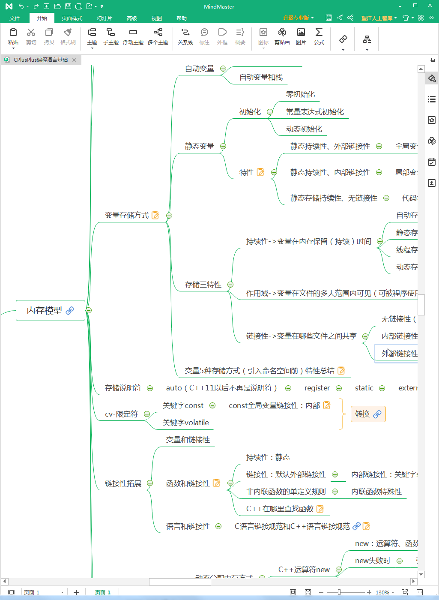
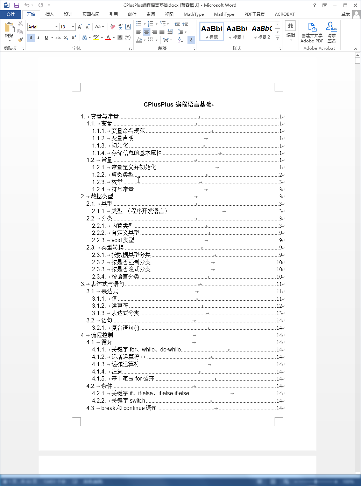
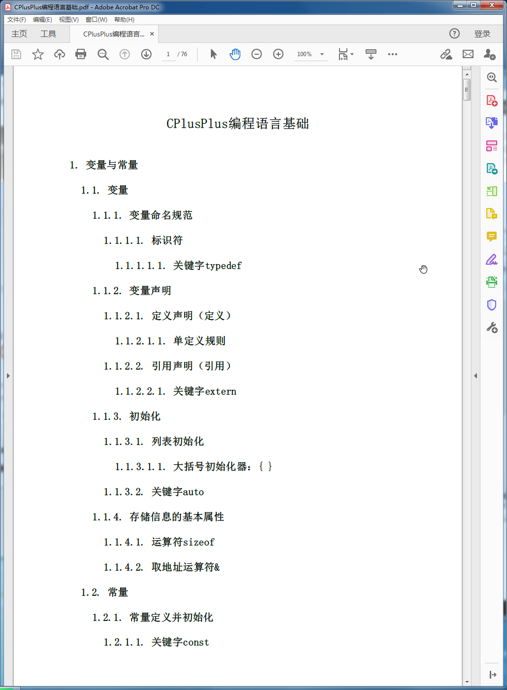
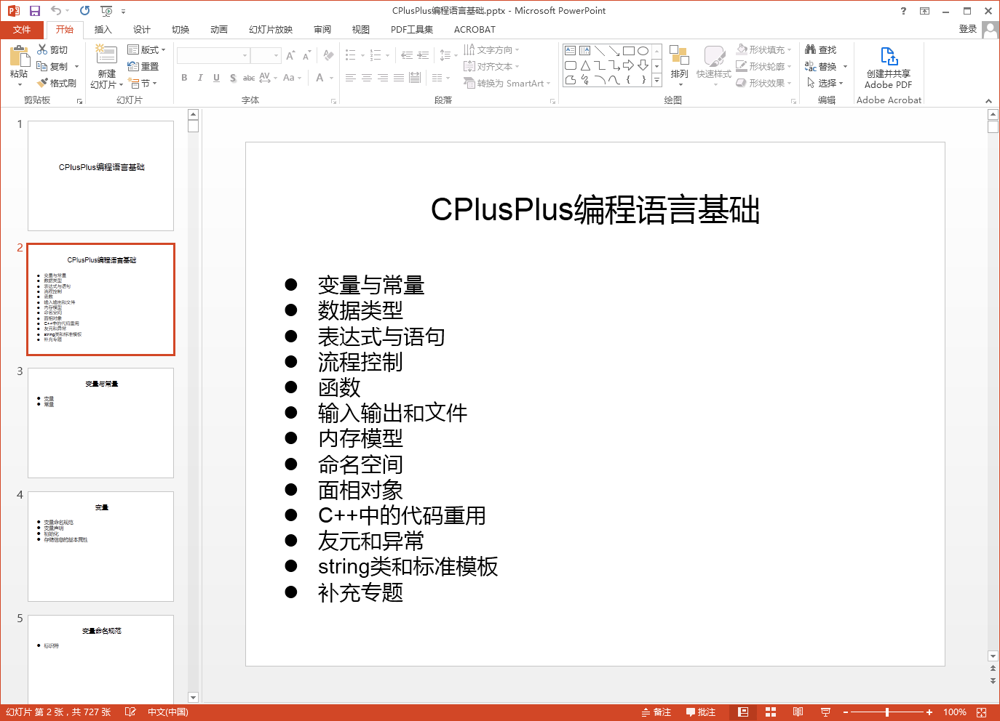
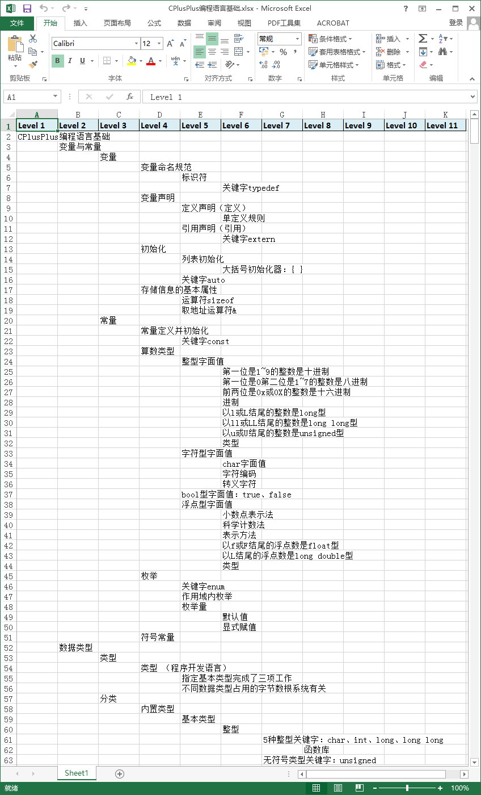

## Cplusplus programming language foundation
 《CPlusPlus编程语言基础》资源，一共归纳整理出五千余条C++知识点，几乎涵盖了C++基础的所有知识，希望此资源能帮助C++初学者入门和C++技术人员参考。

## CPlusPlus编程语言基础

《CPlusPlus编程语言基础》资源，一共归纳整理出五千余条C++知识点，几乎涵盖了C++基础的所有知识，希望此资源能帮助C++初学者入门和C++技术人员参考。

注解：
+ C++是在C语言基础上开发的一种集面向对象编程、泛型编程和过程化编程于一体的编程语言，是C语言的超集。
+ 若读者发现该作品的错误或者有自己的建议，欢迎联系作者袁宵 wangzichaochaochao@gmail.com

### 资源阅读/下载

|在线阅读|下载|
|-|-|
|[CPlusPlus编程语言基础.emmx](https://www.edrawsoft.cn/viewer/public/s/0ccd1475168593)|[下载思维导图版](CPlusPlus编程语言基础/CPlusPlus编程语言基础.emmx)|
|[CPlusPlus编程语言基础.svg](CPlusPlus编程语言基础/CPlusPlus编程语言基础.svg)|[下载svg图片版](CPlusPlus编程语言基础/CPlusPlus编程语言基础.svg)|

CPlusPlus编程语言基础其它格式：
+ [下载word版](CPlusPlus编程语言基础/CPlusPlus编程语言基础.docx)
+ [下载PDF版](CPlusPlus编程语言基础/CPlusPlus编程语言基础.pdf)
+ [下载PPT版](CPlusPlus编程语言基础/CPlusPlus编程语言基础.pptx)
+ [下载Excel版](CPlusPlus编程语言基础/CPlusPlus编程语言基础.xlsx)

### 资源特色
1. 学习高效。相比于书本以线性章节的形式，以二维图形结构式的思维导图的方式展示C++的知识更加生动形象，使用者更容易把握C++基础知识的宏观结构和内容，更加容易理解不同C++知识的联系和区别，更加方便使用者学习、理解和记忆C++知识。
2. 格式丰富。《CPlusPlus编程语言基础》资源以CPlusPlus编程语言基础思维导图为核心，还辅以了相应的PDF、word、PPT和Excel版本的内容，适应于不同的使用方式。
3. 内容权威。本资源内容主要来自C++经典入门巨著C++ Primer Plus 第六版（使用C++11标准），其它参考和引用的内容都标注有出处。

### 资源展示

思维导图截图

word截图

PDF截图

PPT截图

Excel截图

### 更多资源

+ [《C++ Primer Plus英文版（第六版）》](更多资源/CPlusPlusPrimerPlusSixthEdition.pdf)
+ 《CPlusPlus入门》思维导图  [浏览](https://www.edrawsoft.cn/viewer/public/s/76d3e291059318) | [下载](更多资源/CPlusPlus入门.emmx)
